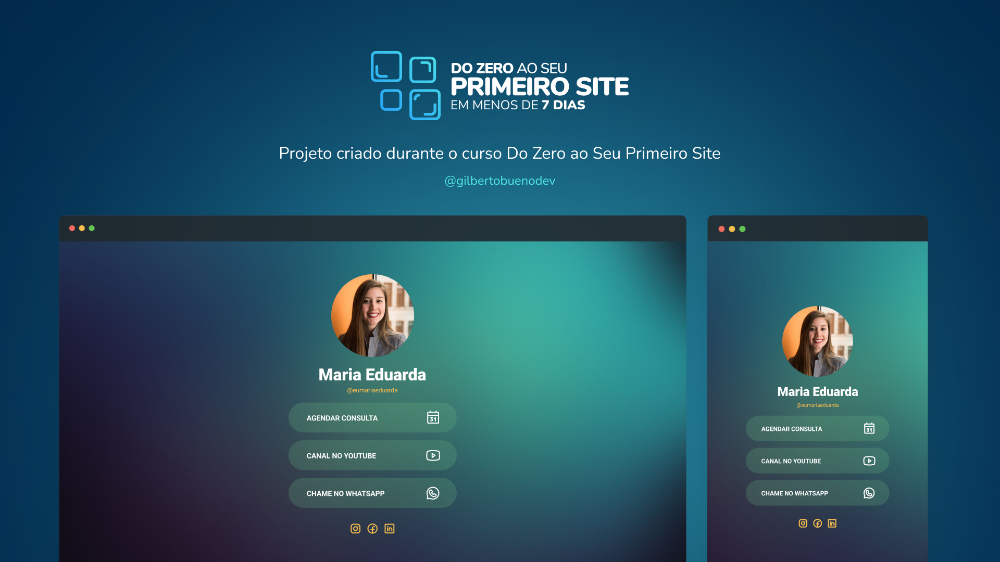

  

<h1 align="center"> Página de Links </h1>

Aprenda a criar essa página completa em menos de 7 dias partindo do absoluto zero.  
<a href="https://gilbertobueno.com.br/primeiro-site?utm_source=github&utm_medium=descricao&utm_campaign=captura&utm_term=organic&utm_content=descricao-github-gilbertobueno">Aprenda como criar este site e ganhar de 2 a 5 mil por mês vendendo sites.</a>

## 🚀 Tecnologias

Esse projeto foi desenvolvido com as seguintes tecnologias:

- HTML e CSS
- Figma

## 💻 Sobre o Projeto

Este é um agregador de links que pode ser usado como cartão de visitas online. Este projeto foi criado durante o curso [Do Zero ao Seu Primeiro Site](https://gilbertobueno.com.br/primeiro-site).

- [Confira o projeto online](https://pagina-de-links.netlify.app)

## 🔖 Layout

Você pode visualizar o layout do projeto através [desse link](https://www.figma.com/community/file/1216468933215337304). Para acessá-lo é necessário ter conta no [Figma](https://figma.com).

## :memo: Licença

Esse projeto está sob a licença MIT.

---

Feito com ♥ por Gilberto :wave: [Me siga no Instagram!](https://instagram.com/gilbertobuenodev)
